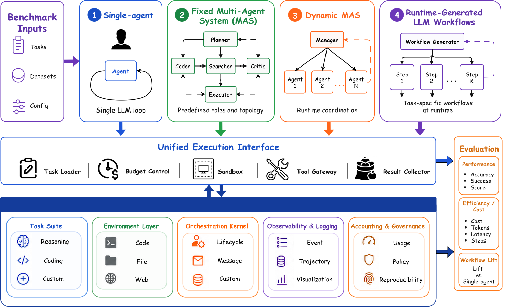

# Do More Agents Help? Controlled and Protocol-Aligned Evaluation of LLM Agent Workflows

[](http://arxiv.org/abs/2510.11111<!todo改真的地址>) [](https://www.python.org/downloads/release/python-3120/) [](LICENSE)

Yuhang Fu, Ruishan Fang, Jiaqi Shao, Huiyu Zheng, Zhengtao Zhu, Bing Luo, Tao Lin

> Does adding more agents help an LLM workflow once compared systems share the same
> benchmark loader, tool access, answer contract, usage accounting, and trajectory logging?
> We introduce **BenchAgent**, an evaluation framework that normalizes single-agent,
> fixed MAS, and evolving MAS workflows under one execution protocol.
>
> Under substrate-internal conditions with GPT-4.1, only 1 of 6 tested MAS exceeds the
> matched single-agent anchor on benchmark-balanced average accuracy (EvoAgent, +1.44 pts,
> within Wilson guidance), while the remaining five trail by 2.56--11.29 points.
> On the PAE GAIA snapshot, a Claude-Code-style runtime workflow reaches 66.72% overall
> and 69.23% on Level 3 — 20+ points above the strongest non-Claude baseline.

<p align="center">
  
</p>

BenchAgent keeps benchmark loading, tool access, usage accounting, logging, and
evaluation fixed while varying the workflow layer across single-agent, fixed
multi-agent, evolving multi-agent, and protocol-aligned external runtime
workflows.

**Figure overview.** The figure shows BenchAgent as a shared evaluation
substrate: benchmark instances enter the same loader, tool interface,
accounting, logging, and evaluator, while only the workflow controller changes.
This separates workflow effects from differences in data handling, tools, or
scoring.

## 🏷️ Keywords

LLM agents · multi-agent systems · agent workflow evaluation · protocol-aligned
benchmarking · GAIA · tool-use agents · workflow lift · runtime-generated
workflows

## ⭐ Key Features

- **Shared evaluation protocol:** normalizes benchmark loading, tool access,
  answer contracts, usage accounting, timeouts, and trajectory logging.
- **Workflow-level comparison:** evaluates single-agent, fixed MAS, evolving
  MAS, and protocol-aligned external runtime workflows under one reporting lens.
- **Broad benchmark coverage:** supports reasoning, coding, instruction
  following, QA, and tool-use benchmarks.
- **Pluggable agent and evaluator registries:** new workflows and benchmarks can
  be added through local registry patterns.
- **Process-aware outputs:** records accuracy, cost, latency, token usage,
  per-problem traces, and visualization-ready artifacts.

## 📌 Key Results

**Substrate-Internal broad benchmark suite.** With GPT-4.1 and matched
benchmark loader, tools, evaluator, logger, and answer contract, fixed and
evolving MAS do not consistently improve over the single-agent anchor.

| Workflow | Paradigm | Avg. Acc. | Avg. Tok. | Avg. Time | Main observation |
|:---|:---|---:|---:|---:|:---|
| Single Agent | Single-agent | 74.12% | 27,434.55 | 106.29s | Matched anchor |
| EvoAgent | Evolving MAS | 75.56% | 34,153.68 | 82.76s | +1.44 pts, within one-run Wilson guidance |
| LLM-Debate | Fixed MAS | 71.56% | 36,669.25 | 26.63s | Helps on checkable tasks, trails on average |
| ChatEval | Fixed MAS | 68.84% | 105,838.02 | 56.08s | Strong on IFEval, most token-intensive |
| Jarvis | Fixed MAS | 66.90% | 9,668.33 | 11.20s | Lightweight but lower accuracy |
| Camel | Fixed MAS | 66.37% | 8,470.19 | 15.75s | Lower-cost, lower-accuracy trade-off |
| AutoGen | Fixed MAS | 62.83% | 13,603.05 | 14.22s | Lowest broad-suite average |

**PAE GAIA runtime-workflow study.** On the full GAIA validation split, the
Claude-Code-style runtime workflow leads especially on longer-horizon tasks.

| Workflow | Paradigm | L1 | L2 | L3 | Overall | Avg. Tok. | Avg. Time |
|:---|:---|---:|---:|---:|---:|---:|---:|
| CC-workflow | Runtime-generated workflow | 60.78% | 69.62% | 69.23% | 66.72% | 52,984.69 | 134.90s |
| Jarvis | Fixed MAS | 66.03% | 43.02% | 19.23% | 46.66% | 332,285.96 | 402.11s |
| Camel | Fixed MAS | 54.90% | 34.00% | 26.92% | 39.60% | 468,587.39 | 387.42s |
| ChatEval | Fixed MAS | 49.02% | 34.88% | 26.92% | 38.17% | 1,886,517.67 | 443.76s |
| Single Agent | Single-agent | 58.82% | 30.00% | 19.23% | 37.56% | 459,652.83 | 213.33s |
| LLM-Debate | Fixed MAS | 52.94% | 34.00% | 15.38% | 37.15% | 414,812.44 | 201.53s |
| EvoAgent | Evolving MAS | 54.90% | 30.00% | 19.23% | 36.30% | 1,573,918.58 | 325.04s |
| AutoGen | Fixed MAS | 56.60% | 30.00% | 11.54% | 35.64% | 383,190.65 | 188.98s |

Takeaway: adding agents is not itself the driver. Workflow structure matters
when it matches the task's error mode; otherwise handoffs can add cost, compress
context, or lose task-critical constraints.

## 🚀 Quick Start

BenchAgent and the paper implementation are maintained on the
[`BenchAgent`](https://github.com/LINs-lab/project_multi_agents_benchmark/tree/BenchAgent)
branch.

```bash
git checkout BenchAgent
uv sync
cp .env.example .env
```

Set your API key in `.env`:

```bash
OPENAI_API_KEY=sk-...
MODEL_NAME=gpt-4o-mini
```

Run the default benchmark:

```bash
./run_benchmark.sh
```

By default, this runs the `math` benchmark with `bench_agent`, async execution,
and the model specified by `MODEL_NAME`. Common overrides are passed as
environment variables:

```bash
BENCHMARK=gaia LIMIT=20 ./run_benchmark.sh
BENCHMARK=mmlu_pro LIMIT=50 MODEL_NAME=gpt-4o ./run_benchmark.sh
BENCHMARK=gaia AGENT_SYSTEM=evoagent CONCURRENCY=8 ./run_benchmark.sh
MANAGER_TOOLS=python_interpreter SEARCH_TOOLS=search,browser ./run_benchmark.sh
```

Results are written under `results/`, and logs are written under `logs/`.

## 🧭 What Is BenchAgent?

BenchAgent is the evaluation substrate used in the paper. Its goal is not to
make one agent look better, but to make different workflows comparable under the
same protocol: benchmark loading, tool access, answer formatting, token
accounting, timeout handling, and trajectory logging.

The framework supports single-agent baselines, fixed multi-agent systems, and
evolving multi-agent systems through the same `AgentSystem` interface. This lets
the paper compare workflows by both final accuracy and process-level signals,
instead of relying on each system's custom runner.

## 🧩 Implementation Overview

The benchmark entrypoint is `run_benchmark.sh`, which wraps:

```bash
uv run python main.py
```

`main.py` parses benchmark, workflow, model, tool, concurrency, and timeout
options, then creates a `BenchmarkRunner`. The runner loads the selected
benchmark evaluator and agent system from registries, normalizes every problem
record, executes the workflow, scores the output, and writes a structured result.

```text
data/*.jsonl
   -> main.py
   -> BenchmarkRunner
   -> AgentSystem.run_agent()
   -> evaluator.evaluate()
   -> results/*.json + *_summary.json + trajectory artifacts
```

For the BenchAgent workflow itself, the implementation lives in
`mas_arena/agents/bench_agent.py`. It builds a two-level agent structure:

- a manager `CodeAgent` that plans, reasons, writes executable snippets when
  useful, and decides when to call tools or delegate;
- a delegated `search_agent` implemented as a `ToolCallingAgent` for web search,
  browsing, Wikipedia lookup, and document-style information gathering;
- a shared OpenAI-compatible model wrapper with retry handling and configurable
  `api_base`, model name, and timeout settings;
- configurable tool lists for manager and search agents, expanded from names
  such as `python_interpreter`, `search`, `browser`, `wikipedia`, and
  `final_answer`;
- optional memory integration for storing successful and failed trajectories in
  later experimental settings.

Every BenchAgent run returns through the same final-answer contract. The base
`AgentSystem` then records messages, token usage, execution time, trajectory
steps, evaluator score, and error state in a uniform `AgentResult`.

## 📊 Benchmarks And Workflows

The runner discovers benchmarks from `mas_arena/evaluators/` and workflows from
`mas_arena/agents/`. Current benchmark examples include:

`math`, `aime`, `gsm8k`, `drop`, `bbh`, `mmlu_pro`, `humaneval`, `mbpp`,
`hotpotqa`, `ifeval`, `gaia`, and `swebench_lite`.

Workflow examples include:

`bench_agent`, `single_agent`, `jarvis`, `evoagent`, `chateval`, `autogen`,
`camel`, `llm_debate`, `metagpt`, `agentverse`, `swarm`, `supervisor_mas`,
`mad`, and `chatdev`.

Run the live registry with:

```bash
uv run python main.py --help
```

## 📁 Outputs

Each run produces a timestamped result file containing a benchmark summary and
per-problem records. The summary tracks accuracy, total and average duration,
token usage, error counts, and the output path. Per-problem records include the
problem id, expected answer, prediction, score, correctness flag, runtime,
recorded LLM usage, and any saved response or visualization artifact.

When verbose mode is enabled, the runner also prints a visualization command for
the generated summary file.
